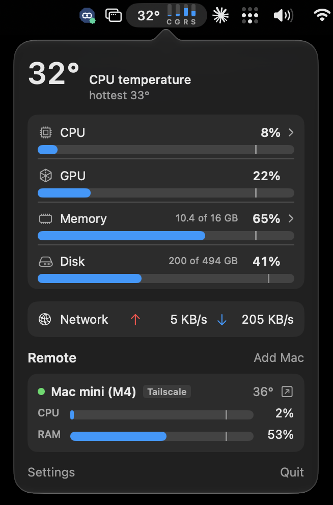

# LogMac

A compact system stats menu bar app for Apple Silicon Macs, written in SwiftUI.

<p align="center">
  
</p>

- **Menu bar:** CPU temperature, always shown, plus four status dots for CPU, GPU, RAM, and SSD. When a metric
  stays over its alert level, the dots expand into mini bars with a label such as `RAM 91%`, then collapse again
  once it's calm.
- **Popover:** per-metric bars with alert markers, network rates, and settings (display mode, alert levels, °F,
  open at login).
- **Processes:** click CPU or Memory for the top processes, with helpers grouped under their app.
  Right-click a process to Quit or Force Quit it.
- **Remote Macs:** watch your other Macs' stats over the local network or Tailscale. Their alerts show in your
  menu bar, e.g. `AIR · RAM 91%`.

## Requirements

- macOS 14 or later, Apple Silicon (temperatures come from Apple Silicon sensors)
- Swift 6 toolchain. Xcode isn't required; the Command Line Tools are enough.

## Build and run

```bash
./scripts/build-app.sh && open build/LogMac.app
```

This builds `build/LogMac.app` (release, ad-hoc signed). To move it to another Mac, copy the app over; if it arrived
by AirDrop or download, clear the quarantine flag once:

```bash
xattr -dr com.apple.quarantine /Applications/LogMac.app
```

`LogMac --dump` prints every temperature sensor and one stats sample, which helps when a chip reports odd values.

## Watching other Macs

1. On the Mac to watch, open the popover → Settings → turn on **Share this Mac's stats** → **Pair new Mac**.
2. On your Mac, choose **Add Mac**, pick it from the list (or type its Tailscale name or IP), and click **Pair**.
3. Both Macs show the same 6-digit code. Check they match and click **Codes match: Pair** on both.

After that the Macs reconnect by themselves over the LAN (via Bonjour) or Tailscale, preferring the LAN. Pairing
works in one direction; pair the other way too to watch both.

Pairing is numeric comparison with commitments, like Bluetooth LE Secure Connections: an X25519 key exchange, where
the sharing Mac commits to its nonce before seeing the other's, so a machine in the middle can't make the two codes
match. The resulting token never crosses the network; later connections answer an HMAC challenge with it. The
protocol is described at the top of `Sources/LogMac/Remote/RemoteProtocol.swift`.

### Security notes

- After pairing, traffic over the LAN is plain TCP: anyone on the network can read the stats, and an active attacker
  could inject messages after authentication. Traffic over Tailscale is encrypted by WireGuard. Running the
  connection over TLS with the pairing token as a pre-shared key is a planned follow-up.
- Pairings are stored in `~/Library/Application Support/LogMac/pairings.json`, readable only by your user.
- Sharing is off by default, and the Bonjour advertisement contains only a random ID, the Mac model, and its chip.

## Private APIs

LogMac uses a few undocumented macOS APIs, so a macOS update could break parts of it:

- `IOHIDEventSystemClient` for temperature sensors (`Sources/SensorsC/sensors.c`)
- `responsibility_get_pid_responsible_for_pid` to group helper processes under their app (`Sources/SensorsC/process.c`)
- `IOAccelerator` performance statistics for GPU usage

The process list shows only processes running as you; system processes need admin rights.

## Tests

The Command Line Tools ship neither XCTest nor Swift Testing, so the pairing checks run from a debug-only entry
point:

```bash
swift run LogMac --selftest
```

It pairs Macs over loopback and checks matching codes and tokens, confirm ordering, busy and cancel handling,
old clients and servers, a tampered commit or reveal, an early `welcome`, and a relay in the middle.

## License

[MIT](LICENSE)
